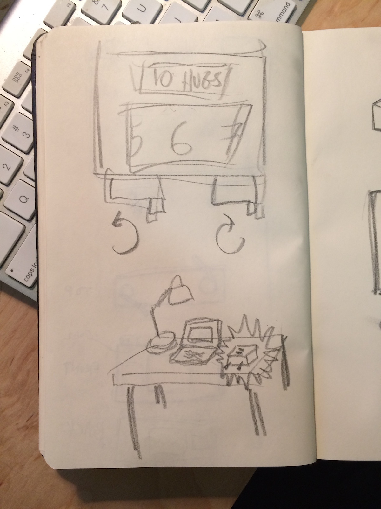
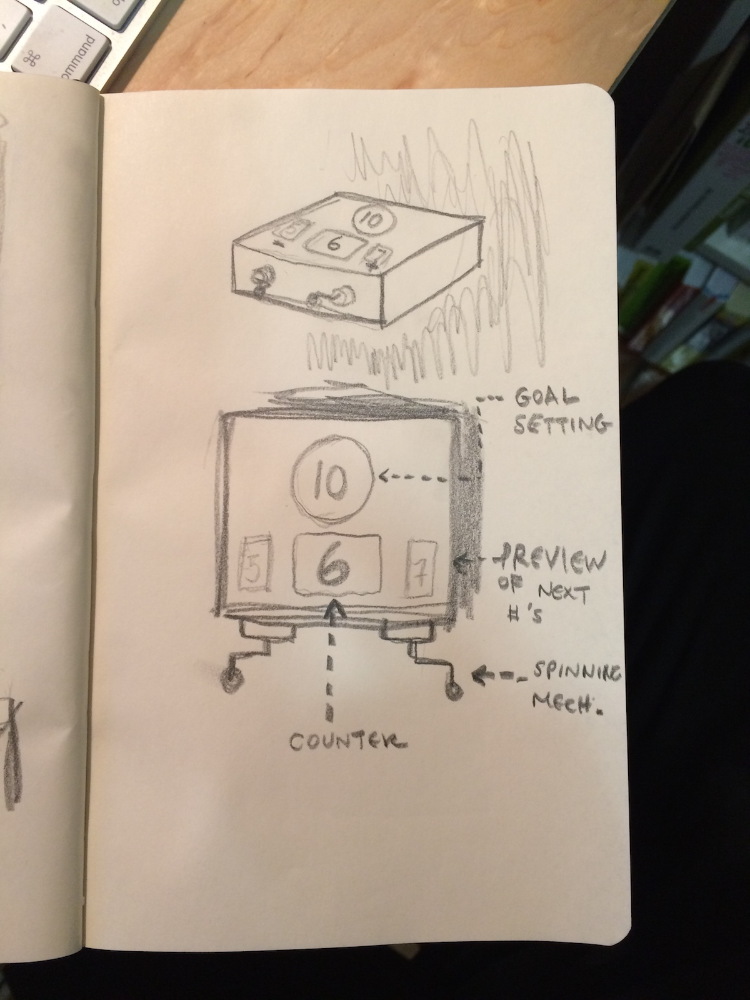
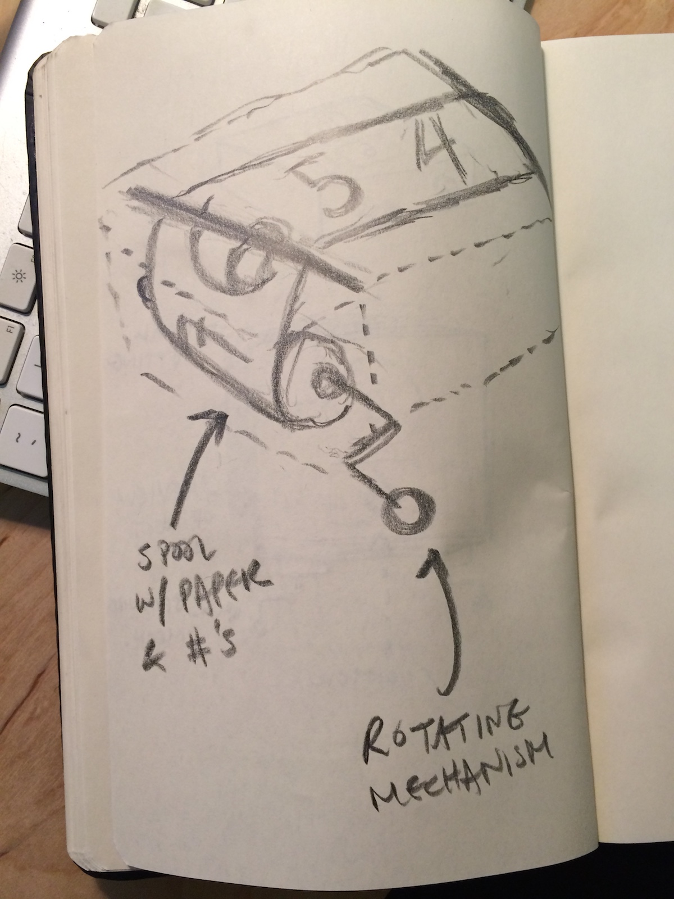
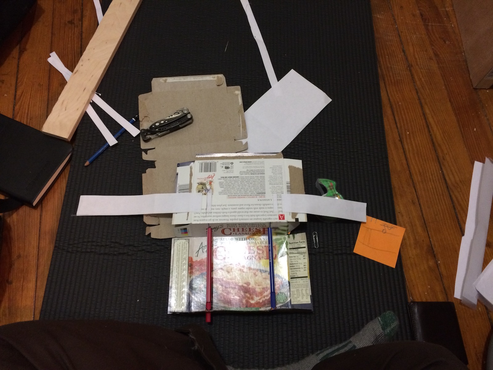
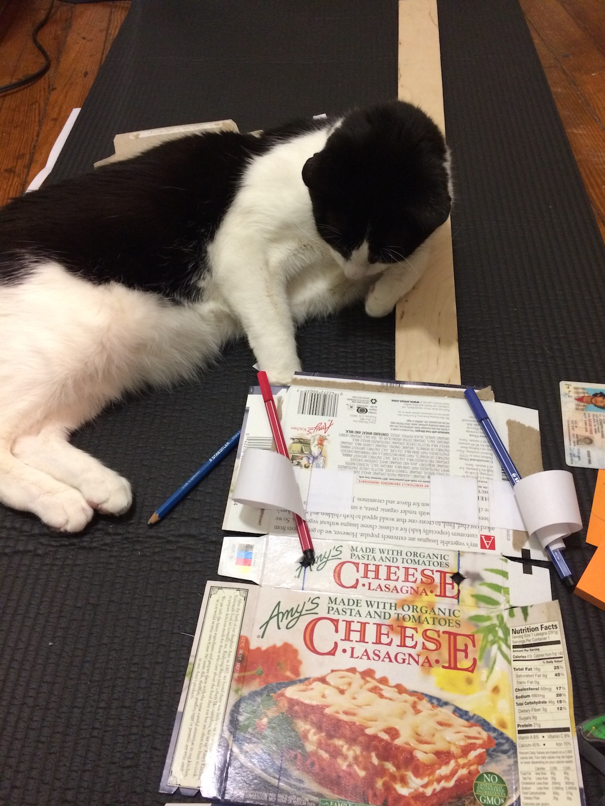
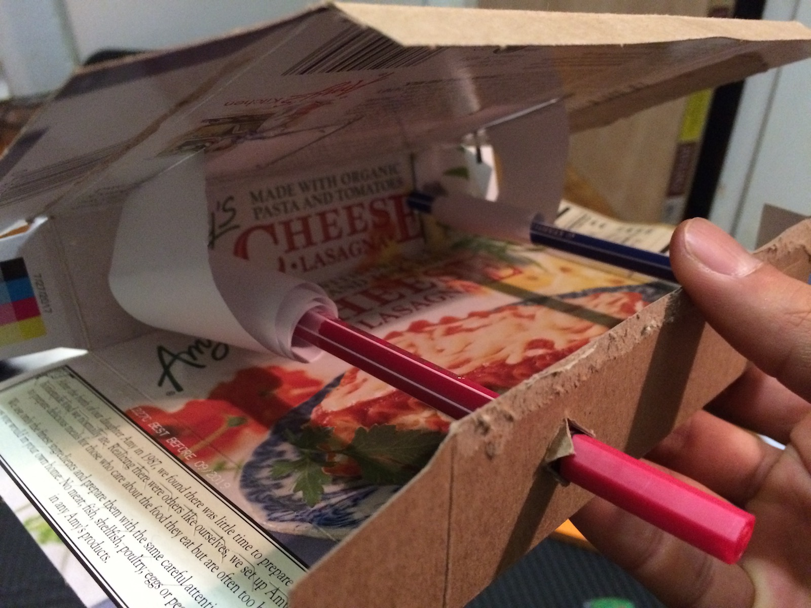
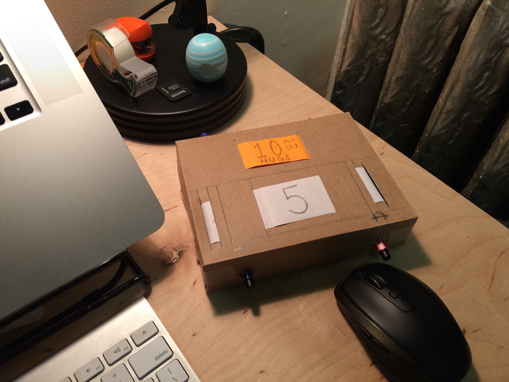
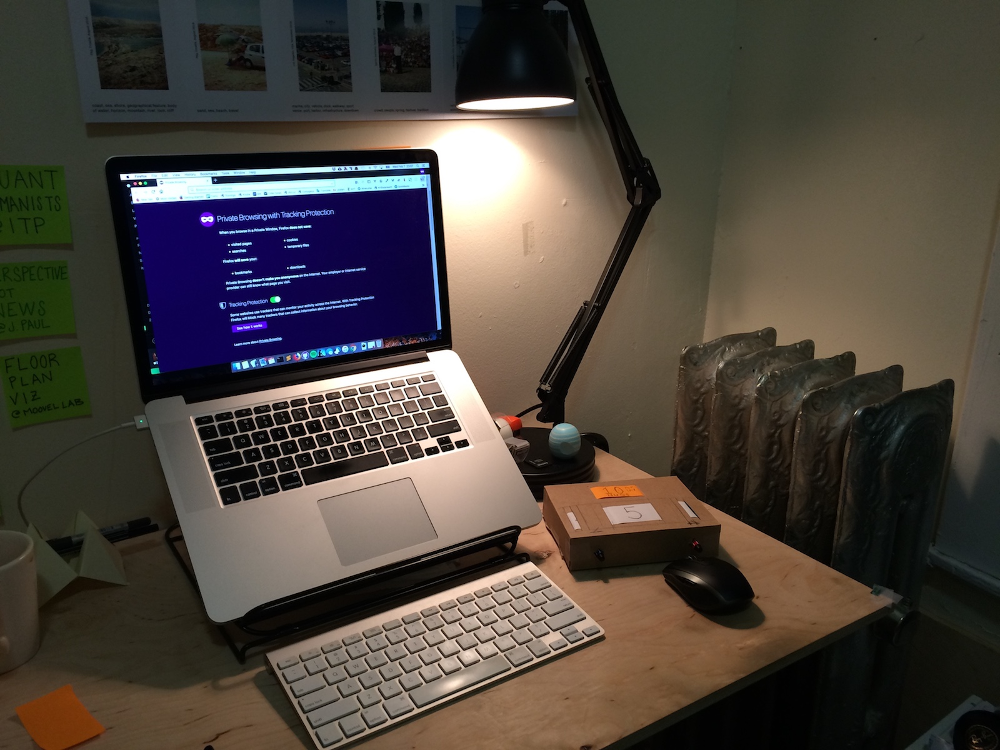
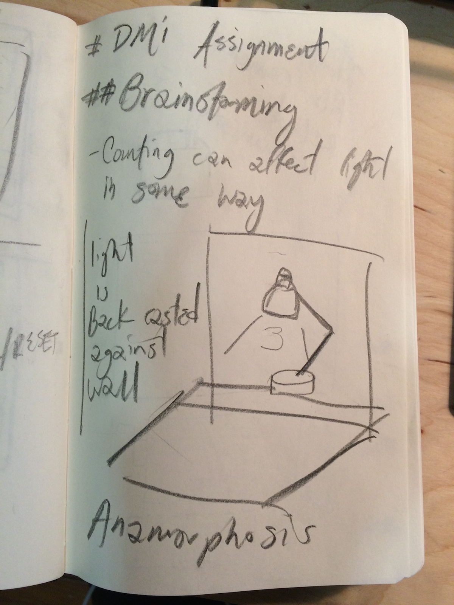

# Week 2: Micro & Macro Interactions

## Class notes

- See NYT explaing why the subway is dysfunctionl: https://www.nytimes.com/2017/11/18/nyregion/new-york-subway-system-failure-delays.html
- Macro to micro ==> examing all the touchpioints @ all scales
- "Design of Everyday Things": Chapter 1 & 2
- Affordances 
- Signifiers
- Mapping
- Constraints
- Visibility
- Feedback / Action <-> Reaction
- Redesign Smart refrigerator interface Exercise
- 3 levels of processing:
    + visceral
    + behavioral
    + reflective
- Week 1 assignment overview:
    + object with good user experience
    + object with bad user experience
- Nice refs:
    + Little Big Details: http://littlebigdetails.com/
    + Apple design tips: https://developer.apple.com/design/tips/
- Make the journey clear!
- Chromeexperiments.com
- 400 years: histography

## Exercise:

**Brief**: Redesign wikipedia for discovery

### Sketches
Just a few brainstorming sketches

#### Geo-discovery, Image Sorting, Gear Concept

## Assignment: Physical Counting Device

### Brief

Create a prototype device to meet these qualifications:

> Design a physical object that can sit on a desk that allows a user to count up or down. The target audience is someone who wants to keep a numeric tally and have a physical reminder of their progress to display for themselves and others on their desk.

**Requirements**

The device has to be able to do all of these things, minimally:

- set a number to count up to
- set a number to count down from
- progress up/down by one
- undo
- display the number

### Research & References:

- Analog Memory Desk: http://kcamara.com/analog-memory-desk
- Film Camera loading mechanism: http://www.dvdtechcameras.com/manuals/cameras/k4/k4.htm, http://kodak.3106.net/index.php?p=509
- Low-tech TV scroll: https://vimeo.com/12516090
- First analog video game in cardboard box: http://www.bitrebels.com/geek/first-analog-video-game-in-a-cardboard-box/
- Hand crank mario lego game: https://laughingsquid.com/a-side-scrolling-super-mario-bros-lego-diorama-operated-by-a-hand-crank/

### Process & output

#### Sketches

#### Protoyping

#### Output

#### Other Ideas

